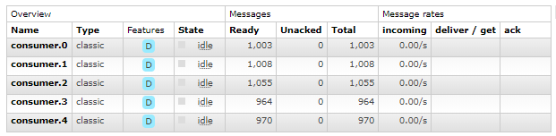
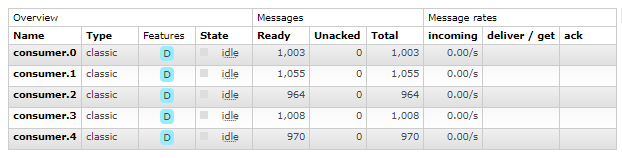

# rabbitmq-consisten-hash-test
This project is used to show a potential error in the consistent-hash plugin of RabbitMQ.

## Prerequisites
- dotnet sdk 3.1 
- RabbitMQ 3.8.2 running with the rabbitmq_consistent_hash_exchange plugin

## Setup RabbitMQ
- An exchange of type `topic` named `exchange-in`
- An exchange of type `x-consistent-hash` named `exchange-consumer` connected to the `exchange-in` exchage
- 5 queues named `consumer.0` through `consumer.4` with a binding to `exchange-consumer` an

## Expected behavior
When sending a batch of 5000 messages each message should go to the same queue even after a restart of RabbitMQ. 

## Test
To execute the test, following the following steps multiple times:
1. execute `dotnet run .`
2. examine the number of messages in the consumer queueus and make note of the number per queue
3. on the rabbitmq instance call: `rabbitmqctl stop_app`
4. on the rabbitmq instance call: `rabbitmqctl stop_app`
5. examine the number of messages in the consumer queueus these should be all 0
6. repeat from step 1 until the values in step 2 are different for 1 or more queues

### Initial run results

### After a few runs

### Problem
After a restart it can't be garanteed that messsages will be sent to the same queue.

